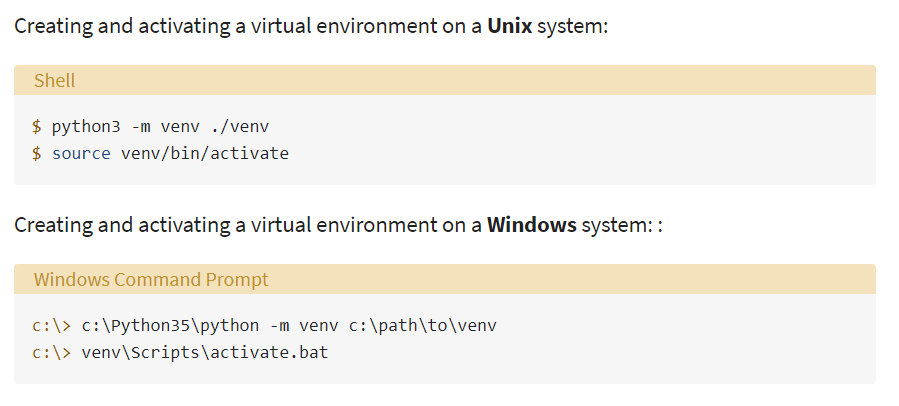
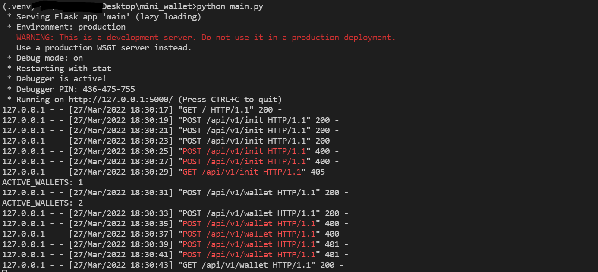
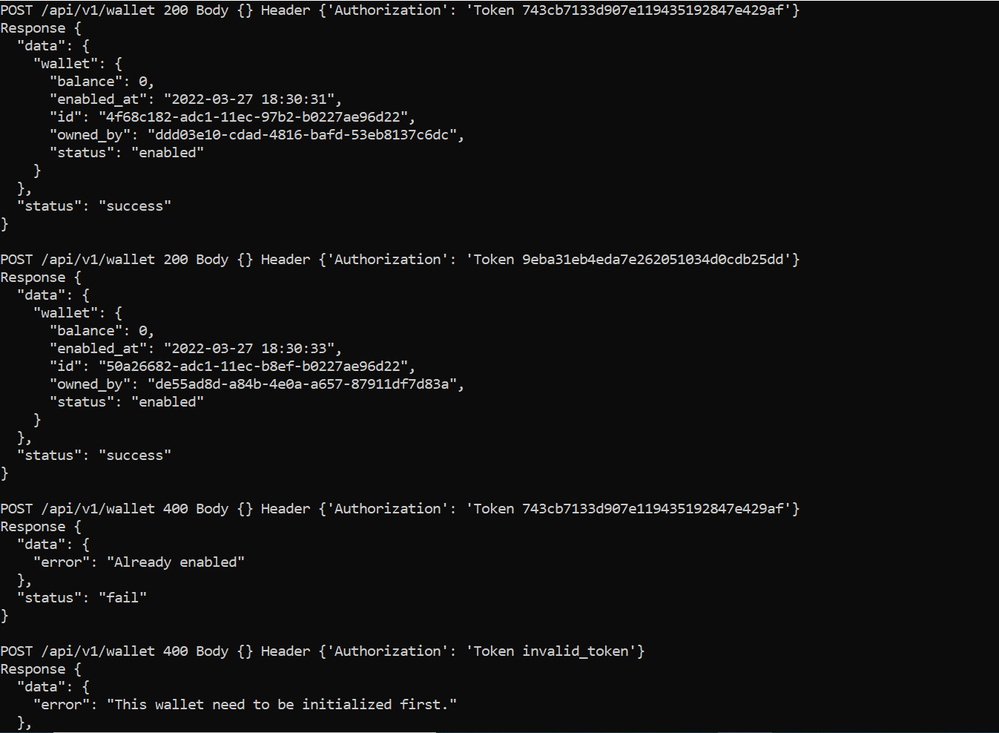
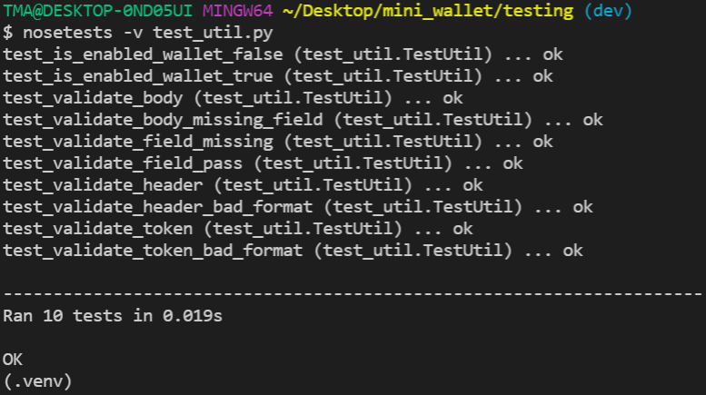

# Mini Wallet Exercise

## Requirement
https://documenter.getpostman.com/view/8411283/SVfMSqA3?version=latest

## How I organize the source code

├── mini_wallet ----------------------------------------------\
│   ├── main.py         >>> API Core\
│   ├── util.py         >>> Library for support API Core\
│   ├── static.py       >>> Declare static variables\
│   ├── decorator.py    >>> Decorator support validating Input\
│   ├── testing ----------------------------------------------\
│   │   ├── test.py             >>> manual testing\
│   │   ├── test.sh             >>> manual testing\
│   │   ├── test_util.py        >>> nosetest\
│   │   ├── test_decorator.py   >>> nosetest\
│   ├── img\
│   ├── .venv\
│   ├── .gitignore\
│   └── README.md\


## Setup environment

You should create a virtual environment for this project. 
You can refer to this image depending on your OS.



```
git clone https://github.com/dinhnhu1401/mini_wallet.git
cd mini_wallet
python -m venv .venv # Create a virtual environment for my PC using Window
.\.venv\Scripts\activate.bat # Activate this environment
python -m pip install -r requirement.txt # Install all dependencies
python main.py # Running on localhost, port 5000
```
It should lool like:




## Perform testing

### Manually testing

These files below performed how the project can be manually tested.
You can leverage it as a reference for your own test cases.

```
cd mini_wallet
.\.venv\Scripts\activate.bat # Activate this environment
cd testing
python test.py # Using Python with requests module
./test.sh      # Using Linux with curl command
```

You can check each request and response easier if using Python Script:



### Unitest

I provide the way to run nosetest manually

```
cd mini_wallet
cd testing
python test_util.py # For short output
python test_decorator.py # For short output
nosetests -v test_decorator.py # For view specific functions inside
nosetests -v test_util.py      # For view specific functions inside
```
Example Ouput:

